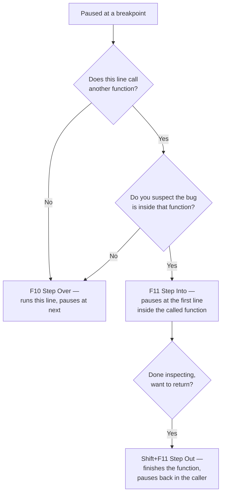

# Diagram: Step Over vs Step Into vs Step Out

The decision from [Example 4](../examples/04-debugging-with-breakpoints.md).

Defaulting to Step Over and only stepping into functions you specifically suspect keeps a debugging session focused — stepping into every single function call quickly buries you in code that isn't the problem.
