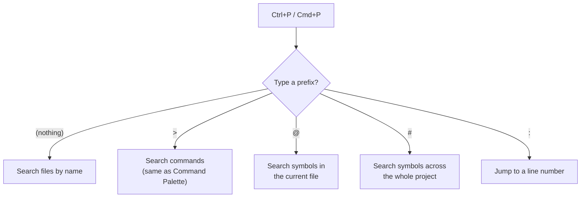

# Diagram: Quick Open Prefix Routing

`Ctrl+P` / `Cmd+P` opens the same box every time — what it searches depends entirely on the prefix you type.

One box, five different search modes — worth knowing all five instead of only ever using the plain file-name search and reaching for other panels for everything else.
