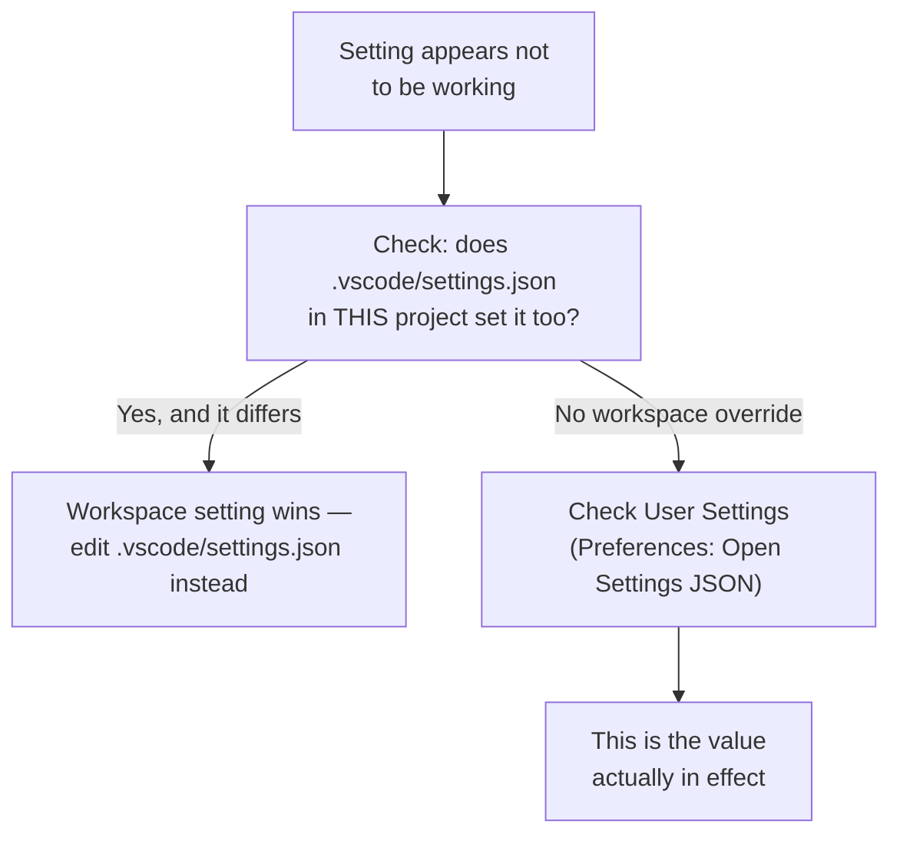

# Diagram: Settings Precedence

Why a setting you changed doesn't seem to be taking effect — the most common cause.

Workspace settings (`.vscode/settings.json`, committed to the repo) always override your personal User settings for that project — which is exactly why a setting can look "broken" when it's actually just being overridden on purpose, often by a teammate's committed config.
